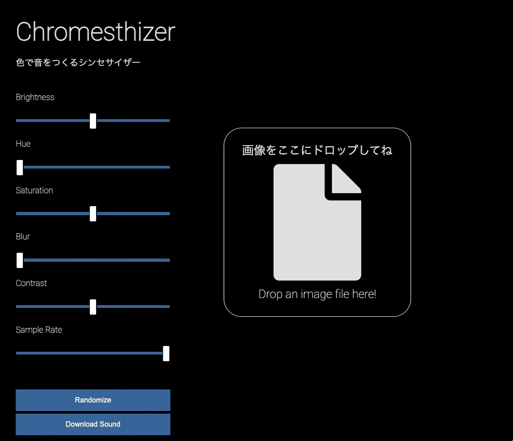

# Chromesthizer

[🔗 Demo](https://chromesthizer.vercel.app/)

A unique audio-visual experiment that transforms images into sound using Web Audio API. Upload any image and hear what it sounds like! The application analyzes the pixel data of your image and converts it into audio waveforms, creating a unique sonic representation of visual content.

## Features
- Drag & Drop interface for easy image upload
- Real-time audio synthesis from image data
- Interactive image filters that directly affect the audio output:
  - Blur
  - Brightness
  - Contrast
  - Saturation
  - Hue
- Adjustable sample rate for audio generation
- Download generated audio as WAV file

## Tech Stack
- Vanilla JavaScript
- Web Audio API
- HTML5 Canvas
- CSS3

## How It Works
The application processes images through these steps:
1. Image data is captured and processed through HTML5 Canvas
2. Pixel data is converted to RGB values
3. The RGB values are used to generate audio waveforms
4. Web Audio API synthesizes the final sound
5. Real-time filters modify both visual and audio output

## Author
Created by [Yuichi Yogo](https://github.com/yuichkun)

---
*This documentation was generated by an LLM*
